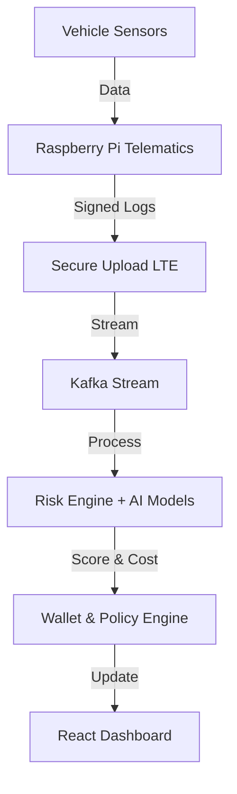

# 🚗 DriveSure — Smart Usage-Based Vehicle Insurance Platform  
**IoT · AI · FinTech · Real-Time Telematics**

> *“Insurance should be based on behavior, not assumptions.”*

**[Live Demo](https://drive-sure-omega.vercel.app/#/)**

DriveSure lets users pay for car insurance **based on how, when, and where they drive** instead of a flat yearly premium.  
Drivers maintain a **digital insurance wallet** that updates in real time after every trip.

---

## 🌍 Overview

DriveSure combines **real-time vehicle telematics**, **AI-based risk scoring**, and a **wallet-based billing model** to create fair, behavior-linked vehicle insurance.  
The vehicle becomes a financial data source: every trip updates the driver’s risk score, insurance wallet, and safety rewards.

---

## 🎯 Problem

Traditional vehicle insurance is static and opaque.

| Problem | Impact |
| :------ | :----- |
| Static pricing | Safe drivers pay the same as risky drivers |
| No real-time monitoring | Accidents happen without accountability or context |
| Fraud | Devices can be unplugged, data manipulated, and claims faked |
| No incentives | No rewards for safe or eco-friendly driving |

---

## 💡 Solution: DriveSure

DriveSure replaces static, yearly premiums with **real-time usage-based pricing** driven by telematics and AI.

| Feature | What it does |
| :------ | :----------- |
| Telematics Device | Collects speed, braking, GPS, and driving patterns from the vehicle |
| AI Risk Engine | Scores every trip with a 0–100 safety score |
| Insurance Wallet | Deducts balance per trip based on risk and usage |
| Reward Engine | Rewards safe driving with cashback and loyalty points |
| Fraud Protection | Detects tampering and signs logs cryptographically |
| Agentic Automation | Uses n8n workflows to automate operations end-to-end |

---

## 📱 Application Modules

The DriveSure web application is the command center for drivers. It is built with **React**, **TypeScript**, and **Vite**, featuring a responsive and modern UI.

### 1. 🏠 Dashboard Hub
The central landing page providing an immediate overview of the driver's financial and safety status.
- **Financial Details**: Real-time view of wallet balance, monthly burn rate, and projected savings.
- **Trip Summary**: Quick access to recent trips and their safety scores.
- **Risk Assessment**: Visual indicators of current risk levels affecting insurance premiums.

### 2. 💳 Smart Wallet (`/dashboard/wallet`)
A dedicated financial management suite for the insurance balance.
- **Real-Time Balance**: Updates immediately after trips based on deductions or rewards.
- **Transaction History**: Detailed logs of trip deductions, top-ups, and cashback rewards.
- **Projections**: Graph-based visualization of balance depletion and estimated refund dates.

### 3. 📈 Driving Analytics (`/dashboard/stats`)
Deep dive into driving behavior using interactive visualizations.
- **Interactive Maps**: Powered by **Leaflet**, visualizing trip routes with color-coded risk segments.
- **Telemetry Charts**: **Recharts** integration showing speed, braking force, and acceleration over time.
- **Safety Score**: Detailed breakdown of the factors contributing to the 0-100 driver score.

### 4. 🏪 Marketplace (`/dashboard/marketplace`)
A dynamic store for insurance products and personalized add-ons.
- **Dynamic Pricing**: Insurance premiums that adjust based on the driver's safety score.
- **Add-ons**: Purchase additional coverage (e.g., Roadside Assistance, Zero Dep) directly from the wallet.
- **Value Tracking**: Monitor the current value of active policies and potential resale value.

### 5. ⚖️ Shield Claims (`/dashboard/claims`)
AI-powered claims processing interface.
- **Instant Estimation**: AI analysis of damage to estimate repair costs (`MotoShield AI`).
- **Payout Payouts**: Instant calculation of deductible vs. payout, credited directly to the wallet.

---

## 🏗️ System Architecture



### 🔄 Trip Processing Flow
1.  **Initiation**: Car starts and trip recording begins.
2.  **Capture**: Sensors capture speed, braking, GPS, and IMU data.
3.  **Edge Analysis**: Edge AI detects risky events (harsh braking, speeding) locally.
4.  **Transmission**: Telematics unit sends cryptographically signed data via LTE.
5.  **Scoring**: Cloud AI Risk Engine computes a trip safety score (0–100).
6.  **Accounting**: Wallet Engine calculates trip-specific deductions and rewards.
7.  **Visualization**: Dashboard updates with trip summary, wallet changes, and risk insights.

---

## 🧠 What We Track

| Category    | Data                                             |
| ----------- | ------------------------------------------------ |
| Speed       | Over-speeding vs. road speed limits              |
| Behavior    | Harsh braking, sharp turns, aggressive maneuvers |
| Time        | Night driving, fatigue-prone time windows        |
| Distance    | Pay-per-mile / pay-per-km usage                  |
| Safety      | Accidents, near misses, incident patterns        |
| Distraction | Phone presence/usage via Bluetooth signals       |
| Environment | Urban vs. highway vs. rural roads                |

---

## 💳 Wallet-Based Insurance Model

Instead of a fixed annual premium, users top up a DriveSure Wallet and pay per drive.

| Driving Style | Wallet Impact |
| :--- | :--- |
| **Safe driving** | Low per-trip deduction + rewards |
| **Rash driving** | Faster balance deduction per trip |
| **Night driving** | Slightly higher dynamic pricing |
| **Accidents** | Emergency risk debit and policy flagging |

---

## 🚀 Technology Stack

### Frontend (User Dashboard)
-   **Framework**: React 19, TypeScript, Vite
-   **Styling**: Tailwind CSS
-   **Visualization**: Recharts (Charts), Leaflet / React-Leaflet (Maps)
-   **Icons**: Lucide React
-   **Routing**: React Router DOM

### Backend & IoT (Infrastructure)
-   **Edge**: Raspberry Pi CM4, GPS, IMU, OBD
-   **Streaming**: Apache Kafka
-   **AI**: Python-based ML models (risk scoring, anomaly detection)
-   **Orchestration**: n8n agentic workflows
-   **API**: FastAPI (REST APIs, auth, risk engine)
-   **Database**: PostgreSQL / Delta Lake

---

## 💻 Getting Started

To run the DriveSure dashboard locally:

1.  **Clone the repository**
    ```bash
    git clone https://github.com/yourusername/drivesure.git
    cd drivesure
    ```

2.  **Install Dependencies**
    ```bash
    npm install
    ```

3.  **Run Development Server**
    ```bash
    npm run dev
    ```

4.  **Configuration**
    -   User data and global constants can be modified in `lib/constants.ts` to simulate different user profiles and balances.

---

## 📊 Dashboard Features

-   **Live Trip Tracking**: Map overlays with event markers.
-   **Wallet Integration**: Real-time balance updates and depletion forecasting.
-   **Risk Analytics**: Comprehensive scoring system for insurers and drivers.
-   **Gamification**: Rewards, cashback, and streaks for safe driving.
-   **Demo Mode**: Fully simulated environment for testing without hardware.

---

## 🧪 Demo Mode (Hackathon-Friendly)

DriveSure includes a fully simulated demo mode that works without physical hardware.
You can simulate:
-   Trips with configurable routes and distances
-   Speed violations and harsh braking events
-   Accidents and near-miss scenarios
-   Wallet debits, risk surcharges, and rewards

---

## 🔮 Future Enhancements

-   Mobile app for drivers (Android/iOS)
-   Fleet management console (B2B)
-   Multi-insurer marketplace for policy selection
-   Carbon-credit rewards for eco-friendly driving
-   Government road-safety and traffic APIs integration
-   On-chain driver NFT identity and verifiable driving history


